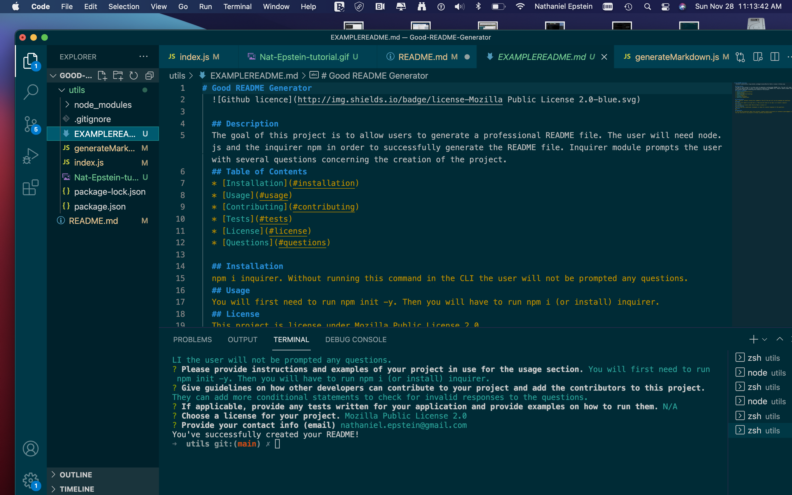

# Good README Generator
  
  
  ## Description 
  The goal of this project is to have users be able to generate professional README files. The user will be prompted several questions using the inquirer module. After the answers have been submitted a README file will be generated!
  ## Table of Contents
  * [Installation](#installation)
  * [Usage](#usage)
  * [Contributing](#contributing)
  * [Tests](#tests)
  * [License](#license)
  * [Bugs](#bugs)
  * [Questions](#questions)
  * [Media](#media)

  
  ## Installation 
  The user must first install node. After that the user will also install the inquirer module. Without the inquirer module, the program will not be able to prompt the user with questions.
  ## Usage 
  You will need to run npm init -y and npm i inquirer
  ## Contributing 
  They can add more conditional statements to check for invalid responses. Nathaniel Epstein.
  ## Tests
  N/A
  ## License 
  This project is license under MIT License
  ## Bugs
  Was not able to get badges to display.

  ## Questions
  If you have any questions about this projects, please contact me directly at nathaniel.epstein@gmail.com. You can view more of my projects at https://github.com/natpitt2393.

  ## Media
  
  
  [napitt2393/Good-README-Generator](https://github.com/natpitt2393/Good-README-Generator)
